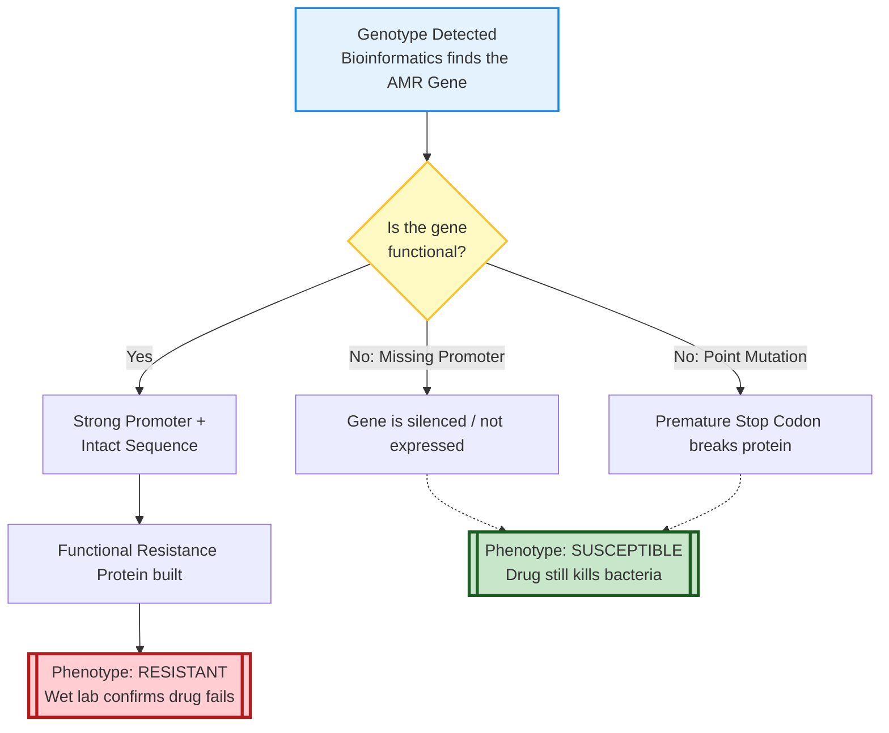
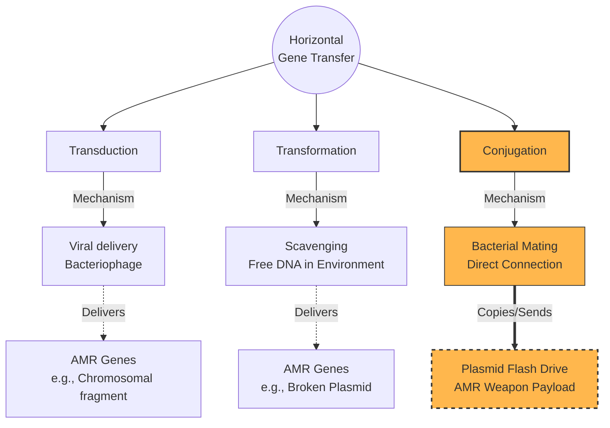
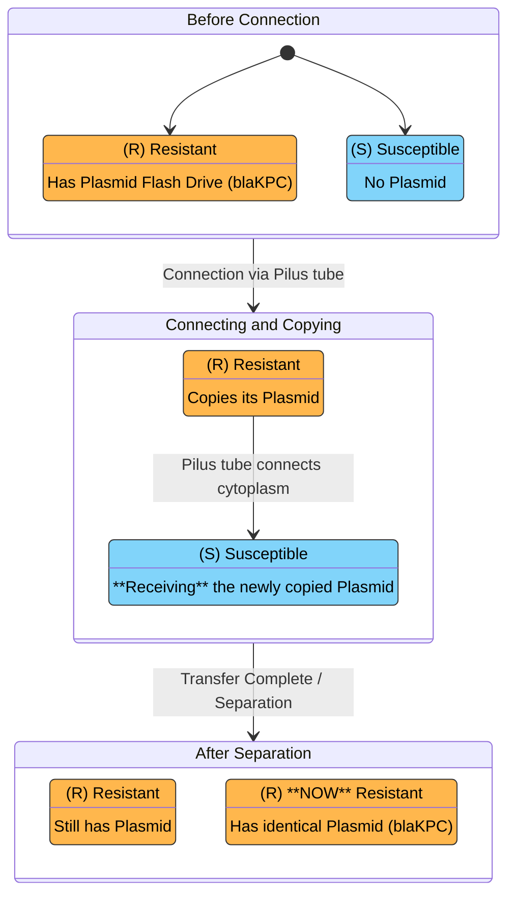
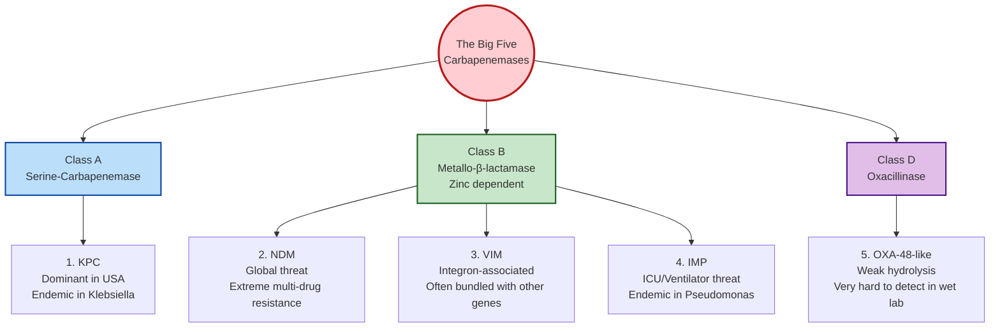

# Finding AMR Genes

## Session Overview

The primary objective of this 30-minute session is to understand that there are various database that can be used to identify AMR genes and the basics of how to use and interpret these resources.

By the end of this 30-minute code-along, participants will be able to:

1. Bioinformatic Execution:

Deploy containerized tools: Successfully run StaphB Docker images (abricate and ncbi-amrfinderplus) using command-line aliases to streamline complex bioinformatics workflows.

Format data for readability: Use command-line utilities (like the column command) to transform raw TSV output files into easily readable tables.

2. Biological & Public Health Concepts:

Differentiate resistance mechanisms: Understand the biological difference between acquired resistance (stolen genes on plasmids) and mutational resistance (evolutionary typos in housekeeping genes).

Acknowledge the Genotype/Phenotype gap: Recognize that the bioinformatic presence of an AMR gene does not automatically guarantee clinical resistance in the wet lab.

3. Data Interpretation & Tool Selection:

Compare search algorithms: Explain why nucleotide-based tools (Abricate) and protein/HMM-based tools (AMRFinderPlus) yield different results for the exact same bacterial genome.

Identify hidden threats: Interpret AMRFinderPlus output to identify critical point mutations (e.g., premature stop codons) and heavy metal/virulence plasmids that standard gene-hunters miss.

## References
* Belay WY, Getachew M, Tegegne BA, Teffera ZH, Dagne A, Zeleke TK, Abebe RB, Gedif AA, Fenta A, Yirdaw G, Tilahun A, Aschale Y. Mechanism of antibacterial resistance, strategies and next-generation antimicrobials to contain antimicrobial resistance: a review. Front Pharmacol. 2024 Aug 16;15:1444781. doi: 10.3389/fphar.2024.1444781. PMID: 39221153; PMCID: PMC11362070.
* Sherry NL, Lee JYH, Giulieri SG, Connor CH, Horan K, Lacey JA, Lane CR, Carter GP, Seemann T, Egli A, Stinear TP, Howden BP. Genomics for antimicrobial resistance-progress and future directions. Antimicrob Agents Chemother. 2025 May 7;69(5):e0108224. doi: 10.1128/aac.01082-24. Epub 2025 Apr 14. PMID: 40227048; PMCID: PMC12057382.
* Sati H, Carrara E, Savoldi A, Hansen P, Garlasco J, Campagnaro E, Boccia S, Castillo-Polo JA, Magrini E, Garcia-Vello P, Wool E, Gigante V, Duffy E, Cassini A, Huttner B, Pardo PR, Naghavi M, Mirzayev F, Zignol M, Cameron A, Tacconelli E; WHO Bacterial Priority Pathogens List Advisory Group. The WHO Bacterial Priority Pathogens List 2024: a prioritisation study to guide research, development, and public health strategies against antimicrobial resistance. Lancet Infect Dis. 2025 Sep;25(9):1033-1043. doi: 10.1016/S1473-3099(25)00118-5. Epub 2025 Apr 14. PMID: 40245910; PMCID: PMC12367593.
* Darby EM, Trampari E, Siasat P, Gaya MS, Alav I, Webber MA, Blair JMA. Molecular mechanisms of antibiotic resistance revisited. Nat Rev Microbiol. 2023 May;21(5):280-295. doi: 10.1038/s41579-022-00820-y. Epub 2022 Nov 21. Erratum in: Nat Rev Microbiol. 2024 Apr;22(4):255. doi: 10.1038/s41579-024-01014-4. PMID: 36411397.
* [abricate](https://github.com/tseemann/abricate)
* Feldgarden M, Brover V, Gonzalez-Escalona N, Frye JG, Haendiges J, Haft DH, Hoffmann M, Pettengill JB, Prasad AB, Tillman GE, Tyson GH, Klimke W. AMRFinderPlus and the Reference Gene Catalog facilitate examination of the genomic links among antimicrobial resistance, stress response, and virulence. Sci Rep. 2021 Jun 16;11(1):12728. doi: 10.1038/s41598-021-91456-0. PMID: 34135355; PMCID: PMC8208984. https://github.com/ncbi/amr


## Tool Installation

Nothing will be installed in this code club, instead we will utilize staphb's docker images for abricate and amrfinder. 

To save us from typing a massive Docker command every single time we want to run a tool, we're going to set up an alias. Think of it like a keyboard shortcut or a speed-dial for your terminal. We teach the computer the long version once, and from then on, we only have to type the name of the tool. This will not be saved between GitHub CodeSpace sessions.

```bash
docker pull staphb/abricate:1.2.0
alias abricate='docker run --rm -v "$(pwd):/data" -w /data staphb/abricate:1.2.0 abricate'
```

```bash
docker pull staphb/ncbi-amrfinderplus:4.2.7-2026-03-24.1
alias amrfinder='docker run --rm -v "$(pwd):/data" -w /data staphb/ncbi-amrfinderplus:4.2.7-2026-03-24.1 amrfinder'
```


## Download some test files
```bash
# Download the zipped assembly file from NCBI
wget -q https://ftp.ncbi.nlm.nih.gov/genomes/all/GCF/002/813/595/GCF_002813595.1_ASM281359v1/GCF_002813595.1_ASM281359v1_genomic.fna.gz

# Decompress the file so our tools can read it
gunzip GCF_002813595.1_ASM281359v1_genomic.fna.gz

# Rename the long NCBI file to something simple
mv GCF_002813595.1_ASM281359v1_genomic.fna klebsiella_isolate.fna
```

## AMR Gene Detection

### Background

AMR Genes are bad. They increase the cost of healthcare and hurt people. There are several databases available for identification of AMR.

1. General Bacteria (Non-TB)These databases primarily catalog acquired resistance genes (e.g., a bacteria picking up a plasmid) and are the engines behind general screening tools like abricate and AMRFinderPlus.DatabaseFull Name / ScopePrimary Use CaseCARDComprehensive Antibiotic Resistance DatabaseThe gold standard for curated AMR ontology and predictive models (Strict vs. Loose hits).NDARONational Database of Antibiotic Resistant Organisms (NCBI)The highly curated dataset powering AMRFinderPlus. Required for NCBI submissions.ResFinderDTU Acquired Antimicrobial Resistance GenesExtremely popular for rapidly identifying genes acquired via horizontal gene transfer.ARG-ANNOTAntibiotic Resistance Gene-ANNOTationA fast, lightweight database often used in local or desktop bioinformatic pipelines.MEGAResHigh-throughput AMR sequence databaseEssential for environmental/metagenomic studies. Includes biocides and heavy metals.BacMetAntibacterial Biocide and Metal Resistance GenesThe definitive source for tracking resistance to industrial chemicals, heavy metals, and disinfectants.SARGStructured ARG databaseDesigned specifically for metagenomic profiling of environmental samples (like wastewater).FARMEFunctional Antibiotic Resistant Metagenomic ElementCatalogs AMR genes discovered purely through functional metagenomics, not sequence homology.BV-BRCBacterial and Viral Bioinformatics Resource CenterA massive aggregator that maps clinical phenotypes to genomic data (formerly PATRIC).2. Mycobacterium tuberculosis (TB)TB resistance is driven by chromosomal point mutations rather than acquired plasmids. These databases track specific single-nucleotide polymorphisms (SNPs) and grade their clinical impact.DatabaseFull Name / ScopePrimary Use CaseWHO CatalogueWHO TB Mutation CatalogueThe ultimate global authority. Grades mutations as "Associated with Resistance," "Benign," or "Uncertain."ReSeqTBRelational Sequencing TB Data PlatformA collaborative platform linking specific genomic mutations directly to lab-verified clinical outcomes.TB-Profiler DBTB-Profiler Internal DatabaseThe underlying library for the most popular command-line TB resistance profiling tool.Mykrobe DBMykrobe Predictor DatabaseUses k-mers to rapidly identify resistance-causing mutations straight from raw reads.CRyPTICComprehensive Resistance Prediction for TBA massive global dataset used to discover and validate rare resistance-conferring mutations.PhyResSETB Lineage and Resistance ServerMaps specific mutations to both drug resistance and evolutionary lineage.3. Viruses (Including Flu)Viral resistance is almost entirely based on structural point mutations that allow the virus to evade drugs or antibodies. Viral databases function as interpretation engines for specific pathogens.VirusDatabasePrimary Use CaseInfluenzaGISAID / EpiFlu (FluSurver)The premier global repository. Scans flu sequences for mutations causing Tamiflu/antiviral resistance.InfluenzaBV-BRC (formerly IRD)Automatically flags sequences containing known "Phenotypic Variant Types" linked to resistance.InfluenzaNCBI Influenza Virus ResourceCentralizes GenBank flu data and uses the FLAN tool to map where resistance mutations occur.InfluenzaOpenFluDBAn isolate-centric database coupling genomic resistance markers with deep epidemiological tracking.HIVStanford HIVdbThe undisputed standard for predicting HIV resistance to Protease, Integrase, and RT inhibitors.HIVLANL HIV Sequence DatabaseLos Alamos National Lab's massive repository tracking global HIV evolution and resistance mutations.SARS-CoV-2Stanford CoV-RDBTracks coronavirus mutations that cause immune escape or resistance to antivirals like Paxlovid.SARS-CoV-2GISAID EpiCoV (CoVSurver)The global pandemic repository, tracking variants of concern and their specific treatment-evading mutations.Hepatitis CHCV-GLUEAutomates the detection of Resistance-Associated Substitutions (RASs) for HCV.Hepatitis B/CGeno2phenoAn interpretive web suite that predicts viral phenotypic resistance from genomic sequences.CMVMRC-University of Glasgow CMV DatabaseTracks mutations conferring resistance in Cytomegalovirus, particularly important for transplant patients.

Today we will focus on bacteria.

The Genomic Architecture of Bacterial AMR
Unlike human cells, bacteria do not keep their DNA locked inside a nucleus. Their genetic material is floating in the cytoplasm and is divided into two primary "neighborhoods." Where an AMR gene is located dictates how the bacteria uses it and, crucially, how quickly it can share that resistance with other bacteria.

1. The Chromosome (The "Hard Drive")
The bacterial chromosome is typically a single, large, circular piece of DNA. It contains all the essential "housekeeping" genes required for the bacteria to live, grow, and reproduce.

Intrinsic Resistance: Some bacteria are naturally resistant to certain antibiotics simply because of their default chromosomal makeup (e.g., they lack the physical target the drug attacks).

Mutational Resistance: If a bacteria is treated with an antibiotic, it might survive by developing a random "typo" (point mutation) in a chromosomal gene. For example, if a drug targets a specific chromosomal protein, a mutation might change the shape of that protein just enough so the drug no longer fits.

Bioinformatic Impact: Tools that look for acquired genes (like abricate) will completely miss these chromosomal point mutations. You need different tools (like AMRFinderPlus or point-mutation databases) to find them.

2. Plasmids (The "Flash Drives")
Plasmids are small, circular, extra-chromosomal pieces of DNA. They are not essential for basic survival, but they carry "bonus" features—most notably, AMR genes.

The Source of "Superbugs": Plasmids are the primary vehicles for acquired resistance. A single plasmid can carry multiple genes, providing resistance to several different classes of antibiotics all at once.

Bioinformatic Impact: When you run an AMR screening tool on a hospital pathogen like Klebsiella or E. coli, you are almost always hunting for genes located on these plasmids.




Mobile Genetic Elements (The "Vehicles")
How do AMR genes actually get onto plasmids or chromosomes in the first place? They use Mobile Genetic Elements (MGEs)—sequences of DNA that can physically cut and paste themselves.

Transposons ("Jumping Genes"): These are segments of DNA that can jump from the chromosome to a plasmid, or from one plasmid to another. They often "carry" AMR genes with them when they jump.

Integrons: Think of integrons as genetic "Velcro." They are specialized capture systems that snag passing AMR genes (called gene cassettes) and stack them up in a row. A single integron can collect half a dozen different resistance genes, creating a highly efficient, multi-drug resistant package.

How AMR Spreads: Horizontal Gene Transfer (HGT)



Because AMR genes live on these mobile elements and plasmids, bacteria don't have to wait to reproduce to pass on resistance (vertical transfer). They can share resistance laterally with their neighbors—even neighbors of a completely different bacterial species.

There are three main ways this happens:

Conjugation (Bacterial "Mating"): Two bacteria physically connect via a tube (pilus), and one copies its AMR-loaded plasmid and sends it directly to the other. This is the most common driver of hospital outbreaks.

Transformation (Scavenging): When a resistant bacteria dies and bursts open, it leaves its DNA floating in the environment. A nearby living bacteria can scavenge that free-floating AMR DNA and incorporate it into its own genome.

Transduction (Viral Delivery): Bacteriophages (viruses that infect bacteria) can accidentally package an AMR gene from one bacteria and inject it into the next bacteria they infect.

When we run our code today, we are taking a bacterial genome that has been shattered into thousands of pieces and reassembled. Our tool is going to scan that digital DNA to find the exact genetic sequences of these plasmids, transposons, and integrons to tell us exactly which weapons this bacteria has collected.



the breakdown of AMR gene anatomy to share with your group.

1. The Size of an AMR Gene
On average, a single bacterial AMR gene is between 500 and 1,500 base pairs (bp) long.

Small Genes (e.g., bla genes for Beta-lactamases): Often around 800–1,000 bp.

Large Genes (e.g., Efflux Pumps): Can be 2,000 to 3,000+ bp because they code for massive, complex physical transport machines that span the bacterial cell wall.

Bioinformatic Context for your Code-Along: Because standard Illumina short-read sequencing only reads 150 bp at a time, bioinformatics tools have to piece these genes back together (assembly) before a tool like abricate can accurately identify them.

2. The Anatomy of the Gene Neighborhood

```mermaid
flowchart LR
    %% Defining the individual DNA components
    IS(Insertion Sequence<br/>e.g., ISAba1) --> Prom(Promoter<br/>'On Switch')
    Prom --> RBS(Ribosome Binding<br/>Site)
    
    RBS --> Start[Start Codon<br/>ATG]
    Start --> AMR[[AMR Gene Sequence<br/>e.g., blaKPC ~1000bp]]
    AMR --> Stop[Stop Codon]
    
    Stop --> Term(Transcriptional<br/>Terminator)
    Term -.-> Next[[Next Gene Cassette<br/>in Operon]]

    %% Grouping them into visual neighborhoods
    subgraph Upstream [Upstream: The 'Control Room']
        IS
        Prom
        RBS
    end

    subgraph Gene [The Actual Resistance Weapon]
        Start
        AMR
        Stop
    end

    subgraph Downstream [Downstream: The 'Brakes' & Linkages]
        Term
        Next
    end

    %% Coloring for visual distinction
    style Upstream fill:#f3e5f5,stroke:#8e24aa,stroke-dasharray: 5 5
    style Gene fill:#e3f2fd,stroke:#1e88e5,stroke-width:2px
    style Downstream fill:#fff3e0,stroke:#f4511e,stroke-dasharray: 5 5
    
    style AMR fill:#bbdefb,stroke:#000,stroke-width:2px
    style IS fill:#ffcdd2,stroke:#000
```


An AMR gene rarely travels alone. To actually function and move, it needs a "control room" upstream and "brakes" downstream.

Upstream (The "Control Room")
The region immediately before the gene's start codon (usually ATG) dictates if and how loudly the gene is expressed.

The Promoter: The binding site for RNA polymerase. If a bacteria picks up an AMR gene but doesn't have a strong promoter upstream, the bacteria remains susceptible to the drug because the gene is essentially "turned off."

Ribosome Binding Site (Shine-Dalgarno Sequence): A short sequence (roughly 8 bases upstream of the start codon) that tells the bacterial machinery where to latch on to start building the resistance protein.

Insertion Sequences (IS Elements): This is a massive driver of resistance! Mobile elements like ISAba1 or IS1 often insert themselves right upstream of an AMR gene. These IS elements bring their own exceptionally strong promoters, inadvertently "cranking the volume" of the AMR gene to maximum and causing hyper-resistance.

Downstream (The "Brakes and Linkages")
The region immediately following the gene's stop codon.

Transcriptional Terminators: Often a stem-loop structure (a sequence of DNA that folds back on itself) that forces the cellular machinery to stop reading.

Additional Gene Cassettes: Bacteria are highly efficient. AMR genes are frequently stacked back-to-back in an "operon." The downstream region of one AMR gene might immediately flow into the upstream region of a second AMR gene, allowing the bacteria to turn on multiple resistance mechanisms with a single promoter.

3. The "Cassette" Structure (Integrons)
If your participants are looking at multi-drug resistant plasmids, they are likely looking at an Integron. Integrons are genetic capture systems, and their upstream/downstream structure is highly rigid and recognizable by bioinformatic tools:

Upstream (The Engine): An intI gene (which produces the Integrase enzyme that "captures" new genes) followed by a strong promoter.

The Target (attI): The specific upstream docking site where new AMR genes get plugged in.

The AMR Gene(s): The actual coding sequence for the resistance protein.

Downstream (attC): A specific recombination site at the end of the gene. This acts like the bottom half of a piece of genetic Velcro, allowing the next captured AMR gene to attach right behind it.

When your participants run their tool and see a column for %COVERAGE in their results, this structure is exactly what the tool is measuring.

If the tool reports 100% coverage, it means it found the complete start-to-finish sequence. If it reports 40% coverage, the tool likely found a broken gene where an Insertion Sequence interrupted the coding region, or the assembly failed to stitch the full 1,000 base pairs back together!

## General Limitations


The Genotype vs. Phenotype Disconnect


A major limitation of bioinformatic AMR screening is that detecting an AMR gene (the genotype) does not guarantee the organism is actually resistant to the antibiotic in real life (the phenotype). Tools like abricate scan for matching DNA sequences, but they cannot tell you if that sequence is actually functioning. For a gene to confer resistance, it must be actively "turned on" (expressed) by the bacteria. A detected gene might lack a strong upstream promoter, meaning the bacteria simply doesn't produce enough of the resistance protein to survive drug exposure. Alternatively, the gene might have a hidden frameshift mutation or an early stop codon that renders the resulting protein broken and useless. Because of these biological variables, genomic AMR detection is an incredibly powerful early-warning and surveillance tool, but it is not a perfect replacement for traditional, wet-lab Antimicrobial Susceptibility Testing (AST) when making critical patient treatment decisions.

How you can frame this in the session:

"Bioinformatics tells us the bacteria owns the blueprint for a weapon. It doesn't tell us if the bacteria actually built the weapon, or if the weapon is broken. That is why the wet lab and the dry lab must always work together."


## metagenomics notes

Here is a breakdown of the pros and cons you can share with your participants to explain the shift from Isolate-based AMR to Metagenomic AMR.

🟢 The Pros: Why Public Health Loves Metagenomics
Culture-Independent (The "See Everything" Approach): Up to 99% of environmental bacteria cannot be grown in a standard lab culture. Metagenomics bypasses the petri dish entirely, allowing you to sequence the DNA of unculturable bacteria and discover AMR genes you would otherwise miss.

The Complete "Resistome": Instead of just looking at the weapons of one pathogen, metagenomics gives you the "resistome"—a snapshot of all the resistance genes present in an entire community (e.g., a city's wastewater or a hospital's plumbing system).

Early Warning & Surveillance: You can detect the arrival of a dangerous AMR gene (like NDM-1 or mcr-1) in a community's wastewater days or weeks before a clinical patient shows up at the hospital with an infection.

Speed in Outbreaks: For slow-growing bacteria (like Mycobacterium tuberculosis, which takes weeks to culture), clinical metagenomics done directly on a patient sample (like sputum) can identify resistance genes much faster than waiting for lab growth.

🔴 The Cons: The Bioinformatics Nightmare
The "Host Linkage" Problem (The Biggest Flaw): When you grind up a sample and sequence all the DNA, it gets mixed together. If your bioinformatic tool finds a terrifying KPC carbapenemase gene, you don't know who it belongs to. Was it carried by a lethal Klebsiella pneumoniae, or was it sitting harmlessly inside a benign, environmental soil bug?

Drowning Out Rare Pathogens: In a metagenomic sample, harmless background bacteria dominate the data. A dangerous AMR pathogen might only make up 0.01% of the DNA in the sample, meaning you might not get enough sequencing depth to confidently piece its AMR genes together.

Point Mutations are Nearly Impossible to Call: Because of the host linkage problem and uneven sequencing depth, it is incredibly difficult to confidently call mutational resistance (like the gyrA mutations you discussed earlier) in a metagenomic soup. You can't tell if the mutation is a real resistance marker or just natural variation from a different bacterial species.

Computationally Exhausting: Assembling a single bacterial genome (isolate) takes a few minutes on a standard laptop. Assembling a complex metagenome can take days and requires massive cloud computing resources or supercomputers.

If you are running Abricate on an isolate, you assemble the genome first and then search for genes. But if you have a metagenomic sample, the assembly process is incredibly messy. Instead, public health bioinformaticians often skip assembly entirely and use 'read-mapping' tools (like SRST2 or KMA) to map the raw, unassembled short reads directly against databases like MEGARes or CARD.

## The Big Five Carbapenemases


1. KPC (Klebsiella pneumoniae carbapenemase)
Class: Serine-Carbapenemase (Class A)

The Background: Originally discovered in Klebsiella pneumoniae in the USA, it has since jumped into E. coli and other Gram-negative bacteria.

Public Health Impact: This is the most common and dominant carbapenemase in the United States and is heavily tracked by the CDC.

2. NDM (New Delhi Metallo-β-lactamase)
Class: Metallo-β-lactamase (Class B - Requires Zinc to function)

The Background: First identified in 2008 in a patient returning from India.

Public Health Impact: Highly feared globally because NDM-producing bacteria are often resistant to almost every known antibiotic, leaving doctors with virtually no treatment options.

3. VIM (Verona Integron-encoded Metallo-β-lactamase)
Class: Metallo-β-lactamase (Class B)

The Background: First discovered in Italy in Pseudomonas aeruginosa.

Public Health Impact: Because it lives on an "integron" (the genetic Velcro we discussed earlier), VIM is almost always bundled with a massive payload of other resistance genes.

4. IMP (Imipenemase)
Class: Metallo-β-lactamase (Class B)

The Background: Originally emerged in Japan in the 1990s.

Public Health Impact: Like VIM, it is heavily associated with Pseudomonas and Acinetobacter species, which are notorious for causing untreatable ventilator-associated pneumonia in ICUs.

5. OXA-48-like (Oxacillinase)
Class: Class D Carbapenemase

The Background: Originally found in Turkey. It is called "OXA-48-like" because there are several closely related variants (like OXA-181 or OXA-232).

Public Health Impact: This one is a bioinformatic and clinical headache. It is notoriously difficult to detect with traditional wet-lab tests because it only weakly hydrolyzes carbapenems, meaning the bacteria might falsely look "susceptible" in a petri dish. Genomic tools like abricate are crucial for catching it.

When we run abricate against the NCBI or CARD database, we get a list of genes. But as public health professionals, we aren't just looking for random resistance; we are hunting for the 'Big Five'—KPC, NDM, VIM, IMP, and OXA-48. If our code outputs a line showing 100% coverage for blaNDM-1, we immediately know we have a critical public health emergency on our hands, and infection control protocols need to be activated.

## Starting from FASTQ or FASTA files

FASTQ : often faster, less processing
FASTA : can perform poorly when two similar genes are in the same isolate

## Using ABRICATE

Abricate: The Rapid AMR Gene Hunter
Abricate is a highly efficient bioinformatics tool designed to mass-screen assembled bacterial genomes for acquired antimicrobial resistance and virulence genes. Think of it as a high-speed search engine for your genomic data: it uses DNA-to-DNA comparison (BLASTN) to rapidly scan your sample's contigs against massive, curated public databases like NCBI, CARD, and ResFinder. Because it focuses specifically on finding "stolen" foreign DNA—such as the resistance genes carried on mobile plasmids—it is incredibly fast and produces a clean, easy-to-read summary table. For a public health bioinformatician, Abricate is the perfect first-pass tool to quickly answer the critical question: "What resistance weapons has this bacteria picked up?"

```bash
# Run the tool and save the output to a TSV file
abricate --db ncbi klebsiella_isolate.fna > abricate_results.tsv

# View the results as a clean table
column -t -s $'\t' abricate_results.tsv
```

The results should look like this
```
#FILE	SEQUENCE	START	END	STRAND	GENE	COVERAGE	COVERAGE_MAP	GAPS	%COVERAGE	%IDENTITY	DATABASE	ACCESSION	PRODUCT	RESISTANCE
klebsiella_isolate.fna	NZ_CP025080.1	1174411	1177563	-	oqxB12	1-3153/3153	===============	0/0	100.00	99.46	ncbi	NG_050430.1	multidrug efflux RND transporter permease subunit OqxB12	PHENICOL;QUINOLONE
klebsiella_isolate.fna	NZ_CP025080.1	1177587	1178762	-	oqxA5	1-1176/1176	===============	0/0	100.00	99.66	ncbi	NG_050423.1	multidrug efflux RND transporter periplasmic adaptor subunit OqxA5	PHENICOL;QUINOLONE
klebsiella_isolate.fna	NZ_CP025080.1	2859578	2860438	+	blaSHV-190	1-861/861	===============	0/0	100.00	99.88	ncbi	NG_050056.1	class A beta-lactamase SHV-190	BETA-LACTAM
klebsiella_isolate.fna	NZ_CP025080.1	4733494	4733913	-	fosA6	1-420/420	===============	0/0	100.00	98.33	ncbi	NG_051497.1	fosfomycin resistance glutathione transferase FosA6	FOSFOMYCIN
```

## Using AMRFINDER

AMRFinderPlus: The Comprehensive Protein Profiler
Developed by the NCBI, AMRFinderPlus is a highly sophisticated tool that goes a step beyond simple DNA matching. Instead of just looking for matching nucleotide sequences, it translates your genomic data into proteins and uses advanced Hidden Markov Models (HMMs) to identify resistance mechanisms. This makes it incredibly powerful because it can detect both acquired foreign genes (just like Abricate) and chromosomal point mutations—the tiny evolutionary "typos" in housekeeping genes that cause resistance to drugs like fluoroquinolones. Backed by NCBI's strictly curated National Database of Antibiotic Resistant Organisms (NDARO), AMRFinderPlus is considered the gold standard for public health reporting, providing a deep, highly accurate, and reliable profile of a pathogen's complete resistance capabilities.

```bash
# Run the tool and specify the organism type (-O Klebsiella_pneumoniae) for better mutation detection
amrfinder -n klebsiella_isolate.fna -O Klebsiella_pneumoniae --plus > amrfinder_results.tsv

# View the results
column -t -s $'\t' amrfinder_results.tsv
```

The results should look like this

```
Protein id	Contig id	Start	Stop	Strand	Element symbol	Element name	Scope	Type	Subtype	Class	Subclass	Method	Target length	Reference sequence length	% Coverage of reference	% Identity to reference	Alignment length	Closest reference accession	Closest reference name	HMM accession	HMM description
NA	NZ_CP025080.1	29523	30704	-	emrD	multidrug efflux MFS transporter EmrD	plus	AMR	AMR	EFFLUX	EFFLUX	BLASTX	394	394	100.00	99.49	394	ACN65732.1	multidrug efflux MFS transporter EmrD	NA	NA
NA	NZ_CP025080.1	1174414	1177563	-	oqxB19	multidrug efflux RND transporter permease subunit OqxB19	core	AMR	AMR	PHENICOL/QUINOLONE	PHENICOL/QUINOLONE	ALLELEX	1050	1050	100.00	100.00	1050	WP_004149399.1	multidrug efflux RND transporter permease subunit OqxB19	NA	NA
NA	NZ_CP025080.1	1177590	1178762	-	oqxA	multidrug efflux RND transporter periplasmic adaptor subunit OqxA	core	AMR	AMR	NITROFURAN/PHENICOL/QUINOLONE/TETRACYCLINE	NITROFURANTOIN/PHENICOL/QUINOLONE/TIGECYCLINE	EXACTX	391	391	100.00	100.00	391	WP_002914189.1	multidrug efflux RND transporter periplasmic adaptor subunit OqxA	NA	NA
NA	NZ_CP025080.1	1603564	1605534	+	cirA_L58Ter	Klebsiella pneumoniae cefiderocol resistant CirA	core	AMR	POINT_DISRUPT	BETA-LACTAM	CEFIDEROCOL	POINTX	657	657	100.00	99.70	657	WP_002912926.1	catecholate siderophore receptor CirA	NA	NA
NA	NZ_CP025080.1	1786275	1795892	+	clbB	colibactin hybrid non-ribosomal peptide synthetase/type I polyketide synthase ClbB	plus	VIRULENCE	VIRULENCE	NA	NA	BLASTX	3206	3206	100.00	99.97	3206	AMQ58400.1	colibactin hybrid non-ribosomal peptide synthetase/type I polyketide synthase ClbB	NA	NA
NA	NZ_CP025080.1	1825991	1830355	+	clbN	colibactin non-ribosomal peptide synthetase ClbN	plus	VIRULENCE	VIRULENCE	NA	NA	EXACTX	1455	1455	100.00	100.00	1455	AMH08480.1	colibactin non-ribosomal peptide synthetase ClbN	NA	NA
NA	NZ_CP025080.1	1878623	1880422	+	ybtP	yersiniabactin ABC transporter ATP-binding/permease protein YbtP	plus	VIRULENCE	VIRULENCE	NA	NA	BLASTX	600	600	100.00	98.83	600	CAA21388.1	yersiniabactin ABC transporter ATP-binding/permease protein YbtP	NA	NA
NA	NZ_CP025080.1	1880412	1882211	+	ybtQ	yersiniabactin ABC transporter ATP-binding/permease protein YbtQ	plus	VIRULENCE	VIRULENCE	NA	NA	BLASTX	600	600	100.00	99.00	600	AAC69584.1	yersiniabactin ABC transporter ATP-binding/permease protein YbtQ	NA	NA
NA	NZ_CP025080.1	1933749	1935842	+	mchF	microcin H47 export transporter peptidase/ATP-binding subunit MchF	plus	VIRULENCE	VIRULENCE	NA	NA	EXACTX	698	698	100.00	100.00	698	AAL08400.1	microcin H47 export transporter peptidase/ATP-binding subunit MchF	NA	NA
NA	NZ_CP025080.1	2859578	2860435	+	blaSHV-11	broad-spectrum class A beta-lactamase SHV-11	core	AMR	AMR	BETA-LACTAM	BETA-LACTAM	ALLELEX	286	286	100.00	100.00	286	WP_004176269.1	broad-spectrum class A beta-lactamase SHV-11	NA	NA
NA	NZ_CP025080.1	4733497	4733913	-	fosA	FosA5 family fosfomycin resistance glutathione transferase	core	AMR	AMR	FOSFOMYCIN	FOSFOMYCIN	EXACTX	139	139	100.00	100.00	139	WP_004146118.1	FosA5 family fosfomycin resistance glutathione transferase	NA	NA
NA	NZ_CP025080.1	5370063	5370962	-	fieF	CDF family cation-efflux transporter FieF	plus	STRESS	METAL	NA	NA	EXACTX	300	300	100.00	100.00	300	BAB89353.1	CDF family cation-efflux transporter FieF	NA	NA
NA	NZ_CP025081.1	23982	25454	-	silS	copper/silver sensor histidine kinase SilS	plus	STRESS	METAL	COPPER/SILVER	COPPER/SILVER	BLASTX	491	491	100.00	98.98	491	SPD96882.1	copper/silver sensor histidine kinase SilS	NA	NA
NA	NZ_CP025081.1	25450	26127	-	silR	copper/silver response regulator transcription factor SilR	plus	STRESS	METAL	COPPER/SILVER	COPPER/SILVER	BLASTX	226	226	100.00	97.35	226	SPD96883.1	copper/silver response regulator transcription factor SilR	NA	NA
NA	NZ_CP025081.1	26317	27699	+	silC	Cu(+)/Ag(+) efflux RND transporter outer membrane channel SilC	plus	STRESS	METAL	COPPER/SILVER	COPPER/SILVER	BLASTX	461	461	100.00	99.35	461	SPD96884.1	Cu(+)/Ag(+) efflux RND transporter outer membrane channel SilC	NA	NA
NA	NZ_CP025081.1	27731	28090	+	silF	Cu(+)/Ag(+) efflux RND transporter periplasmic metallochaperone SilF	plus	STRESS	METAL	COPPER/SILVER	COPPER/SILVER	BLASTX	120	117	100.00	94.17	120	KGL71342.1	Cu(+)/Ag(+) efflux RND transporter periplasmic metallochaperone SilF	NA	NA
NA	NZ_CP025081.1	28207	29496	+	silB	Cu(+)/Ag(+) efflux RND transporter periplasmic adaptor subunit SilB	plus	STRESS	METAL	COPPER/SILVER	COPPER/SILVER	BLASTX	430	430	100.00	98.14	430	AAD11748.1	Cu(+)/Ag(+) efflux RND transporter periplasmic adaptor subunit SilB	NA	NA
NA	NZ_CP025081.1	29510	32653	+	silA	Cu(+)/Ag(+) efflux RND transporter permease subunit SilA	plus	STRESS	METAL	COPPER/SILVER	COPPER/SILVER	BLASTX	1048	1048	100.00	98.85	1048	AAD11749.1	Cu(+)/Ag(+) efflux RND transporter permease subunit SilA	NA	NA
NA	NZ_CP025081.1	33289	35754	+	silP	Ag(+)-translocating P-type ATPase SilP	plus	STRESS	METAL	SILVER	SILVER	BLASTX	822	824	99.64	94.53	823	AAD11750.1	Ag(+)-translocating P-type ATPase SilP	NA	NA
NA	NZ_CP025081.1	37738	39552	+	pcoA	multicopper oxidase PcoA	plus	STRESS	METAL	COPPER	COPPER	BLASTX	605	605	100.00	99.83	605	CAA58525.1	multicopper oxidase PcoA	NA	NA
NA	NZ_CP025081.1	39561	40448	+	pcoB	copper-binding protein PcoB	plus	STRESS	METAL	COPPER	COPPER	BLASTX	296	296	100.00	99.66	296	CAA58526.1	copper-binding protein PcoB	NA	NA
NA	NZ_CP025081.1	40491	40868	+	pcoC	copper resistance system metallochaperone PcoC	plus	STRESS	METAL	COPPER	COPPER	EXACTX	126	126	100.00	100.00	126	CAA58527.1	copper resistance system metallochaperone PcoC	NA	NA
NA	NZ_CP025081.1	40876	41802	+	pcoD	copper resistance inner membrane protein PcoD	plus	STRESS	METAL	COPPER	COPPER	BLASTX	309	309	100.00	99.35	309	CAA58528.1	copper resistance inner membrane protein PcoD	NA	NA
NA	NZ_CP025081.1	41860	42537	+	pcoR	copper response regulator transcription factor PcoR	plus	STRESS	METAL	COPPER	COPPER	EXACTX	226	226	100.00	100.00	226	CAA58529.1	copper response regulator transcription factor PcoR	NA	NA
NA	NZ_CP025081.1	42537	43934	+	pcoS	copper resistance membrane spanning protein PcoS	plus	STRESS	METAL	COPPER	COPPER	BLASTX	466	466	100.00	99.14	466	CAA58530.1	copper resistance membrane spanning protein PcoS	NA	NA
NA	NZ_CP025081.1	112378	113490	+	iroB	salmochelin biosynthesis C-glycosyltransferase IroB	plus	VIRULENCE	VIRULENCE	NA	NA	BLASTX	371	371	100.00	90.30	371	EOW04219.1	salmochelin biosynthesis C-glycosyltransferase IroB	NA	NA
NA	NZ_CP025081.1	113636	117271	+	iroC	salmochelin/enterobactin export ABC transporter IroC	plus	VIRULENCE	VIRULENCE	NA	NA	BLASTX	1212	1219	99.51	89.04	1213	AUH19662.1	salmochelin/enterobactin export ABC transporter IroC	NA	NA
NA	NZ_CP025081.1	117385	118611	+	iroD	catecholate siderophore esterase IroD	plus	VIRULENCE	VIRULENCE	NA	NA	BLASTX	409	409	100.00	98.78	409	AVE24993.1	catecholate siderophore esterase IroD	NA	NA
NA	NZ_CP025081.1	119074	121245	+	iroN	siderophore salmochelin receptor IroN	plus	VIRULENCE	VIRULENCE	NA	NA	EXACTX	724	724	100.00	100.00	724	BAH65949.1	siderophore salmochelin receptor IroN	NA	NA
NA	NZ_CP025081.1	121677	122576	-	peg-344	DMT family inner membrane transporter PEG344	plus	VIRULENCE	VIRULENCE	NA	NA	EXACTX	300	300	100.00	100.00	300	BAH65947.1	DMT family inner membrane transporter PEG344	NA	NA
NA	NZ_CP025081.1	122652	123050	-	rmpC	mucoid phenotype regulator RmpC	plus	VIRULENCE	VIRULENCE	NA	NA	BLASTX	133	133	100.00	90.23	133	AIK83625.1	mucoid phenotype regulator RmpC	NA	NA
NA	NZ_CP025081.1	123406	123525	-	rmpD	mucoid phenotype synthesis protein RmpD	plus	VIRULENCE	VIRULENCE	NA	NA	EXACTX	40	40	100.00	100.00	40	QIK04195.1	mucoid phenotype synthesis protein RmpD	NA	NA
NA	NZ_CP025081.1	123584	124213	-	rmpA	mucoid phenotype regulator RmpA	plus	VIRULENCE	VIRULENCE	NA	NA	EXACTX	210	210	100.00	100.00	210	AMA27886.1	mucoid phenotype regulator RmpA	NA	NA
NA	NZ_CP025081.1	141346	143064	+	iucA	aerobactin synthase IucA	plus	VIRULENCE	VIRULENCE	NA	NA	BLASTX	573	576	99.83	90.09	575	EGI25746.1	aerobactin synthase IucA	NA	NA
NA	NZ_CP025081.1	143071	144015	+	iucB	N(6)-hydroxylysine O-acetyltransferase IucB	plus	VIRULENCE	VIRULENCE	NA	NA	BLASTX	315	315	100.00	94.60	315	AAN82074.1	N(6)-hydroxylysine O-acetyltransferase IucB	NA	NA
NA	NZ_CP025081.1	144018	145748	+	iucC	NIS family aerobactin synthetase IucC	plus	VIRULENCE	VIRULENCE	NA	NA	BLASTX	577	580	99.48	92.72	577	AAN82073.1	NIS family aerobactin synthetase IucC	NA	NA
NA	NZ_CP025081.1	147126	149312	+	iutA	ferric aerobactin receptor IutA	plus	VIRULENCE	VIRULENCE	NA	NA	BLASTX	729	731	99.73	89.57	729	AAN45165.2	ferric aerobactin receptor IutA	NA	NA
NA	NZ_CP025081.1	177316	177888	-	terE	tellurium resistance cAMP binding protein TerE	plus	STRESS	METAL	TELLURIUM	TELLURIUM	BLASTX	191	191	100.00	98.95	191	AAA98293.1	tellurium resistance cAMP binding protein TerE	NA	NA
NA	NZ_CP025081.1	177978	178553	-	terD	tellurium resistance membrane protein TerD	plus	STRESS	METAL	TELLURIUM	TELLURIUM	BLASTX	192	192	100.00	98.96	192	AAA98292.1	tellurium resistance membrane protein TerD	NA	NA
NA	NZ_CP025081.1	178595	179632	-	terC	tellurium resistance membrane protein TerC	plus	STRESS	METAL	TELLURIUM	TELLURIUM	BLASTX	346	346	100.00	99.13	346	AAA98291.1	tellurium resistance membrane protein TerC	NA	NA
NA	NZ_CP025081.1	179659	180111	-	terB	tellurium resistance membrane protein TerB	plus	STRESS	METAL	TELLURIUM	TELLURIUM	EXACTX	151	151	100.00	100.00	151	ACI12150.1	tellurium resistance membrane protein TerB	NA	NA
NA	NZ_CP025081.1	180137	181285	-	terA	tellurium resistance system protein TerA	plus	STRESS	METAL	NA	NA	BLASTX	383	383	100.00	97.39	383	AHE47495.1	tellurium resistance system protein TerA	NA	NA
```

## Summary of AMR Screening Results

Our *Klebsiella pneumoniae* isolate was screened using two different tools to demonstrate how bioinformatic search algorithms affect public health reporting.

### 1. Abricate Results (The "Gene Hunter")
Abricate quickly scanned the isolate against the NCBI database using nucleotide alignment (DNA-to-DNA). It identified four acquired resistance genes located on the primary sequence (`NZ_CP025080.1`).

| Gene | Resistance Profile | Coverage | Identity |
| :--- | :--- | :--- | :--- |
| **`oqxB12`** | Phenicol; Quinolone (Efflux Pump) | 100% | 99.46% |
| **`oqxA5`** | Phenicol; Quinolone (Efflux Pump) | 100% | 99.66% |
| **`blaSHV-190`** | Beta-Lactam (Penicillins/Cephalosporins) | 100% | 99.88% |
| **`fosA6`** | Fosfomycin | 100% | 98.33% |

**Key Takeaway:** Abricate gives us a rapid, accurate baseline of the foreign AMR genes this bacteria has acquired. However, it completely ignores anything that isn't a known, whole acquired gene.

---

### 2. AMRFinderPlus Results (The "Protein Profiler")
By translating the DNA into proteins and utilizing the `--plus` flag, AMRFinderPlus provided a vastly more comprehensive profile, yielding over 20 hits across two different genomic sequences.

#### Core AMR & The "Hidden" Mutation
AMRFinderPlus found the same general acquired genes as Abricate (`oqx`, `blaSHV`, `fosA`), but it also found something critical that Abricate missed:

* **`cirA_L58Ter` (POINT_DISRUPT):** A point mutation created a premature stop codon, breaking the `cirA` gene. This specific broken receptor confers resistance to **Cefiderocol**, a last-resort antibiotic. *Because Abricate only looks for whole acquired genes, it is blind to broken ones!*

#### The "Plus" Features: Plasmids, Metals, and Virulence
AMRFinderPlus revealed that this isolate has two distinct DNA sequences: a chromosome (`NZ_CP025080.1`) and a massive plasmid (`NZ_CP025081.1`). This plasmid is loaded with stress and virulence factors that make this bacteria incredibly dangerous in a hospital environment.


| Category | Genes Identified | Clinical / Public Health Impact |
| :--- | :--- | :--- |
| **Heavy Metals** | `silA-P` (Silver), `pcoA-S` (Copper), `terA-E` (Tellurium) | Bacteria can survive on hospital surfaces, resisting copper fixtures and silver-lined catheters. |
| **Hyper-Virulence** | `rmpA`, `rmpC`, `rmpD` | Creates a thick, "mucoid" capsule that protects the bacteria from the patient's immune system. |
| **Iron Scavenging** | `iucA-D`, `iroB-N`, `ybtP-Q` | Siderophores allow the bacteria to steal iron directly from the human host's blood to fuel its own rapid growth. |

---

### The Final Verdict for Public Health
If we relied solely on Abricate, we would report a standard multidrug-resistant *Klebsiella*. By using **AMRFinderPlus**, we uncovered a broken gene causing resistance to a last-resort drug, *plus* a massive survival plasmid carrying heavy metal resistance and hyper-virulent capsule genes. 

**Genomic context and tool selection completely change the clinical picture!**

## Appendix: Deep Dive Concepts